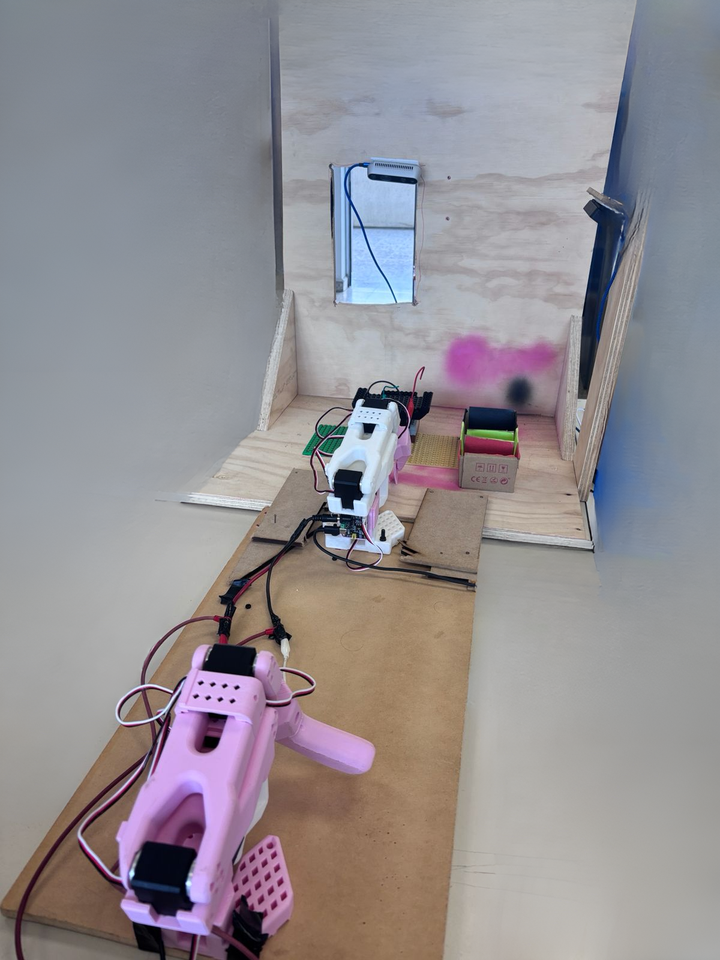
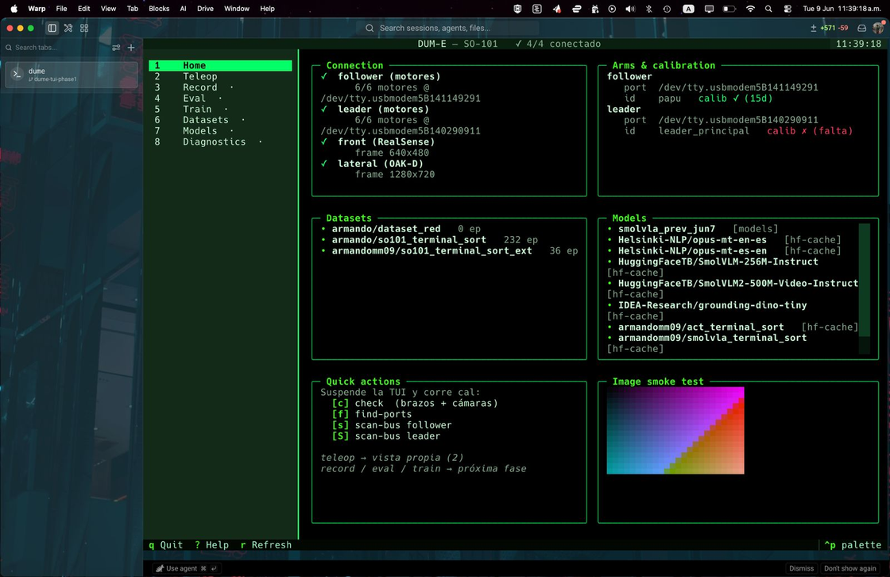
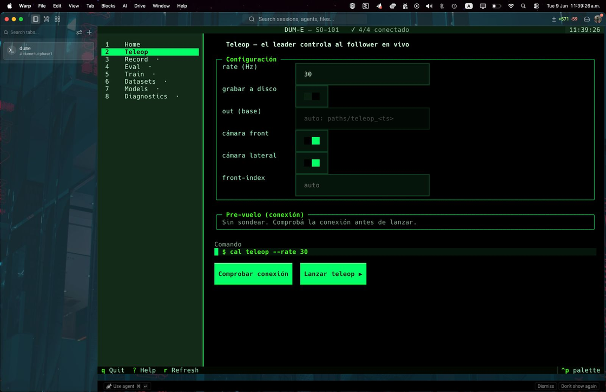
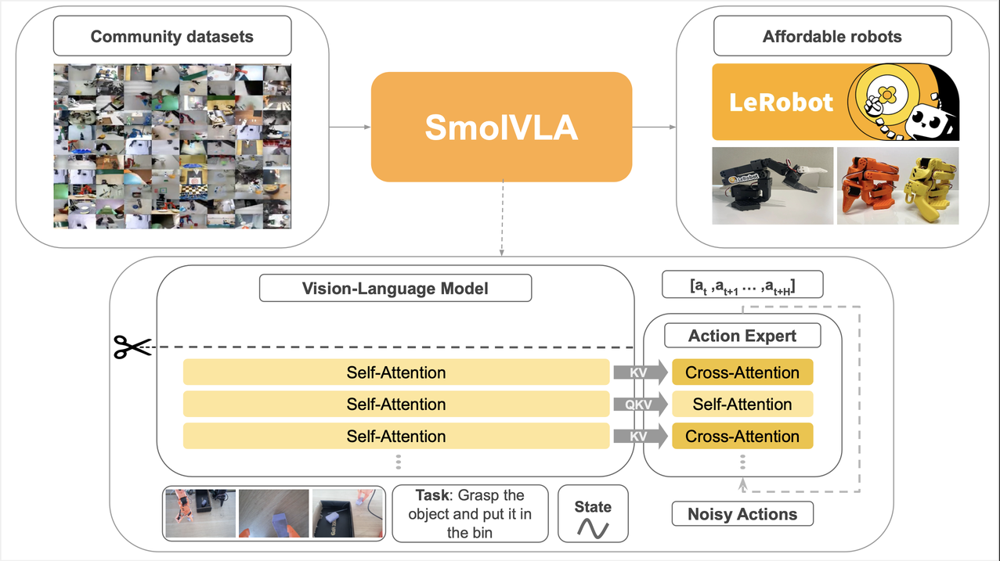
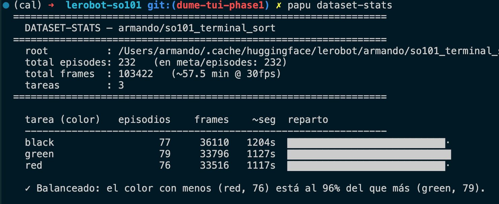
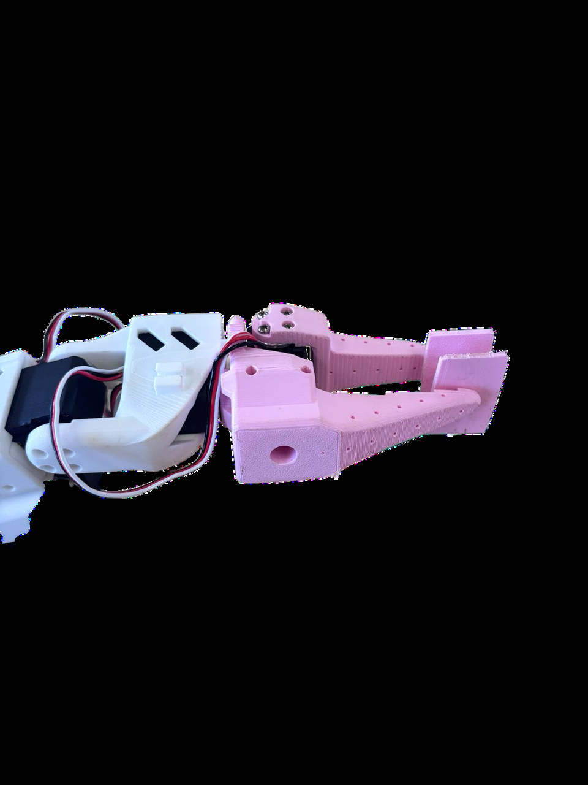

<div align="center">

# 🦾 Dum-E — SO-101 Vision-Language-Action Robotics

**Teach a low-cost SO-101 arm to sort cables by color through behavioral cloning — no hand-coded perception or motion planning.**

Built on [Hugging Face LeRobot](https://github.com/huggingface/lerobot) · benchmarking **SmolVLA** vs **ACT** · shipped as the `dume` CLI + TUI.

[](https://pypi.org/project/dume/)
[](https://pypi.org/project/dume/)
[](https://pypi.org/project/dume/)
[](LICENSE)
[](https://github.com/huggingface/lerobot)
[](https://huggingface.co/blog/smolvla)
[](https://textual.textualize.io/)
[](https://huggingface.co/armandomm09/smolvla_terminal_sort_ft)
[](https://huggingface.co/datasets/armandomm09/so101_terminal_sort)

</div>

```bash
pip install dume      # then run:
dume                  # 🚀 the icon-rich SO-101 cockpit (TUI)
```


> [!NOTE]
> **Dum-E** is the academic project (cable-sorting with a Vision-Language-Action policy); **`dume`** is the open-source tool we built to operate the robot. One install, two modes: the icon-rich Textual **TUI** (`dume`) and a fully scriptable **CLI** (`dume run <subcommand>`).

---

## Table of Contents

- [Overview](#overview)
- [Quick install](#quick-install)
- [The `dume` TUI & `dume run` CLI](#the-dume-tui--dume-run-cli)
- [Hardware](#hardware)
- [The task](#the-task)
- [Method & architecture](#method--architecture)
- [Dataset](#dataset)
- [Models & datasets](#models--datasets)
- [Experimental design](#experimental-design)
- [Results & expectations](#results--expectations)
- [Install from source (development)](#install-from-source-development)
- [End-to-end workflow](#end-to-end-workflow)
- [Project layout](#project-layout)
- [Roadmap](#roadmap)
- [Team](#team)
- [Acknowledgments](#acknowledgments)
- [License](#license)

---

## Overview

**Problem.** Manually coding perception, grasping, and color-dependent logic is rigid and hard to scale. Classic imitation-learning policies on low-cost hardware often fail to recover from small execution errors.

**Hypothesis.** Behavioral cloning lets the SO-101 learn complex sorting *without* explicit motion programming, and a **Vision-Language-Action** policy (**SmolVLA**) — conditioned on a natural-language task — generalizes to new object positions better than a vision-only baseline (**ACT**).

**Objective.** Teach the SO-101 to sort cables by color (**black, green, red**) via behavioral cloning from teleoperated demonstrations, and test whether a single SmolVLA policy handles all three colors, benchmarked against ACT.

<div align="center">

<br><sub>Leader + follower SO-101 with the cable-sorting task environment.</sub>
</div>

## Quick install

`dume` is published on [PyPI](https://pypi.org/project/dume/) and installs a single command, `dume`, with two modes — the **TUI** and the scriptable **`dume run`** CLI.

```bash
pip install dume          # or: pipx install dume  /  uv tool install dume

# TUI mode
dume                      # open the cockpit
dume teleop               # jump straight to a view
dume --ascii              # plain mode (no Nerd Font / inline images)

# CLI mode (scriptable)
dume run check            # connectivity health check (arms + cameras)
dume run --help           # full command list
```

> [!IMPORTANT]
> The PyPI wheel pulls `lerobot[feetech]` (Torch, DepthAI, …) and assumes you have the **SO-101 arms and cameras** attached. For training you need a CUDA GPU (or Apple `mps`). To hack on the project itself, use [install from source](#install-from-source-development).

## The `dume` TUI & `dume run` CLI

One tool, **two modes, one robot**:

| Mode | Command | Purpose |
|------|---------|---------|
| **TUI** | `dume` | Icon-rich Textual cockpit: live connection status, arm/calibration health, dataset & model inventory, quick actions, inline camera test, and form-driven views (teleop, …). |
| **CLI** | `dume run <subcommand>` | Scriptable, one-shot operations: ports, motor setup, calibration, teleop, dataset recording, training, eval, push/pull to the HF Hub. |

Both modes are thin front-ends over the same `so101_cli` modules. The TUI never reimplements robot logic — it reuses those modules by import for read-only display, and for heavy/interactive ops it suspends and shells out to `dume run`.

<table>
<tr>
<td width="50%"><br><sub><b>Home cockpit</b> — connection, arms+calibration, datasets, models, quick actions, inline image test.</sub></td>
<td width="50%"><br><sub><b>Teleop view</b> — editable fields recompose a live <code>$ dume run teleop …</code> preview, then launch with the full TTY.</sub></td>
</tr>
</table>

A condensed `dume run` command map (full reference in [`so101_cli/COMMANDS.md`](so101_cli/COMMANDS.md)):

```bash
dume run find-ports                                  # identify which USB port is which arm
dume run setup-motors follower|leader                # assign motor IDs 1..6
dume run check                                       # both arms + both cameras health check
dume run teleop [--rate 30] [--record]               # live leader → follower (+ optional recording)
dume run record-dataset ... / dume run record-batch  # capture VLA demos → HF Hub
dume run train [--type smolvla|act] [--device cuda]  # wrap lerobot-train
dume run eval --color red|green|black [--n N]        # roll a trained policy on the follower
dume run eval-viz --color red                        # eval + ResNet activation heatmap (rerun)
dume run push|pull dataset|model ...                 # sync with the HF Hub
dume run dataset-stats                               # per-color episode/frame balance
```

## Hardware

| # | Component | Role |
|---|-----------|------|
| 2× | **SO-101 arm** (5 joints + gripper, 6 DOF) — Feetech STS3215 servos | Leader (teleop handle) + follower (executes) |
| 1× | **Intel RealSense D435** | `front` camera (top-down task view) |
| 1× | **OAK-D Pro** | `lateral` camera (side view, DepthAI) |
| 1× | **αFusion / Fusion XPark** | GPU machine for training |
| — | 2× Waveshare USB-to-TTL adapters | Two stable `/dev/ttyACM*` serial buses |
| — | Cardboard box, wood, LEGOs, colored cables | Task environment |

- **Follower:** 6× STS3215 with 1/345 reduction.
- **Leader:** 6× STS3215 with mixed gearing (1/191, 1/345, 1/147 per joint) so it moves with little force.

See [`docs/armado.md`](docs/armado.md) for the build guide.

## The task

A single natural-language instruction per episode — *"pick the &lt;color&gt; cable and place it in the &lt;color&gt; box"* — across **black / green / red** cables placed in varying positions. The follower receives target joint positions every tick at **30 fps**.

## Method & architecture

Both policies are trained by **supervised behavioral cloning**: the model imitates expert demonstrations captured via leader→follower teleoperation, minimizing the gap between its predicted actions and the expert's.

<div align="center">

<br><sub>SmolVLA: multimodal vision + language + state → flow-matching action expert.</sub>
</div>

**SmolVLA (Vision-Language-Action)**
- **SigLIP** vision encoder embeds the multi-camera feeds; **SmolLM** embeds the language task; a linear projection tokenizes proprioception.
- **Early-fusion** concatenation merges visual + text + state tokens, processed by a deep self-attention **VLM backbone**.
- An **action expert** with interleaved cross/self-attention and **flow matching** denoises a random vector into motor commands, solved by a numerical ODE solver.

**Learning techniques**
- **Action chunking** — the model emits a short burst of future joint commands per inference.
- **Fine-tuning** — initialize from pretrained SmolVLA weights and train on the full dataset.
- **Linear probing** — freeze the pretrained backbone (SmolVLM2-500M) to cheaply adapt to the new gripper geometry.
- **Flow matching** — gradually transform random noise into the correct action.

**ACT baseline** — a vision-only Action-Chunking Transformer, used as the benchmark to isolate the value of language conditioning.

## Dataset

- Collected by **teleoperation** and recorded with LeRobot — one task string per episode.
- Each frame synchronizes, from a single capture loop, the **6 follower joint states + front camera + lateral camera**; the 6 target joint positions are sent to the follower every tick at 30 fps.
- Stored in the **LeRobot v3 layout** on the Hugging Face Hub: episodes batched into shared Parquet files, one MP4 per camera.
- **Balanced by construction** — episodes are recorded in randomized batches of 3 (one per color) so classes stay even as the dataset grows.
- **Two published datasets:** the main 232-episode [`so101_terminal_sort`](https://huggingface.co/datasets/armandomm09/so101_terminal_sort), plus a smaller [`so101_terminal_sort_ext`](https://huggingface.co/datasets/armandomm09/so101_terminal_sort_ext) of **fresh demos recorded after we extended the gripper** (see [Experimental design](#experimental-design)). The extended fingers changed the arm's kinematics, so old grasp heights no longer matched — we recorded a clean dataset on the new geometry and fine-tuned from it, deliberately **never mixing old- and new-gripper demos** in one dataset.

<div align="center">

<br><sub><code>dume run dataset-stats</code> — the main dataset: 232 episodes, ~57.5 min @ 30 fps, balanced across black/green/red.</sub>
</div>

## Models & datasets

All artifacts are **public on the Hugging Face Hub** 🤗.

**Policies**

| Model | Type | Role |
|-------|------|------|
| [`smolvla_terminal_sort_ft`](https://huggingface.co/armandomm09/smolvla_terminal_sort_ft) | SmolVLA (fine-tuned) | **Current best** — fine-tuned on the extended-gripper demos |
| [`smolvla_terminal_sort`](https://huggingface.co/armandomm09/smolvla_terminal_sort) | SmolVLA | Base VLA trained on the full 232-episode dataset |
| [`act_terminal_sort`](https://huggingface.co/armandomm09/act_terminal_sort) | ACT | Vision-only baseline for the SmolVLA-vs-ACT benchmark |

**Datasets**

| Dataset | Role |
|---------|------|
| [`so101_terminal_sort`](https://huggingface.co/datasets/armandomm09/so101_terminal_sort) | Main balanced cable-sorting dataset (232 episodes, 3 colors) |
| [`so101_terminal_sort_ext`](https://huggingface.co/datasets/armandomm09/so101_terminal_sort_ext) | Fresh demos on the **extended gripper**, used for the fine-tune |

```bash
dume run pull model  --repo-id armandomm09/smolvla_terminal_sort_ft         # grab the policy
dume run pull dataset --repo-id armandomm09/so101_terminal_sort             # grab the dataset
dume run eval --color red --policy armandomm09/smolvla_terminal_sort_ft     # roll it on the follower
```

## Experimental design

| | Conditions |
|---|---|
| **Training** | Cables at known positions/orientations, consistent lighting, demos by teleoperation. |
| **Evaluation** | New cable locations and rotations not seen during recording, with small lighting variations — on the real follower, **no leader needed**. |

A real-world adaptation surfaced mid-project: the **original gripper had insufficient contact surface**, so we extended it to increase grasp area. The geometry change meant recording a small set of fresh demos to **fine-tune** the existing model.

<div align="center">

<br><sub>Extended gripper tips — more contact surface, then a fine-tune on fresh demos.</sub>
</div>

## Results & expectations

- Trained on **232 balanced episodes (~57.5 min @ 30 fps)**.
- **Target:** the fine-tuned VLA sorts black/green/red cables into the correct boxes with a **>70% success rate** across evaluation episodes.
- The extended gripper is expected to improve grasp reliability; the model should tolerate small lighting variations and new cable rotations.
- Validated by eval runs on the follower SO-101 alone (no teleoperation).

**Feasibility & limitations.** Low-cost accessible hardware + behavioral cloning is practical; transfer learning and cheap fine-tuning make the VLA tractable. Limits: a human-collected dataset, BC can drift into states not covered by demonstrations, a narrow domain (specific cables), and slow real-world testing.

## Install from source (development)

LeRobot is vendored as an **editable path dependency** at `./lerobot` (managed with [`uv`](https://docs.astral.sh/uv/)). `setup.sh` bootstraps everything.

```bash
git clone https://github.com/armandomm09/dume
cd dume
bash setup.sh                 # installs uv, ensures Python 3.12, clones lerobot/, uv sync
source .venv/bin/activate
cp .env.example .env          # fill HUGGINGFACE_TOKEN and HF_USER
```

**USB permissions (Linux, once):**
```bash
sudo usermod -aG dialout $USER   # then log out and back in
```

**Stable port names (optional):** edit `udev/99-so101.rules` with your adapter serials, then:
```bash
sudo cp udev/99-so101.rules /etc/udev/rules.d/
sudo udevadm control --reload-rules && sudo udevadm trigger
```

In a checkout, the repo wrapper `./dume` runs the same code as the installed command (`./dume run <subcommand>` for the CLI).

## End-to-end workflow

```bash
# 1. Detect ports, set up motors, calibrate (once per arm)
dume run find-ports
dume run setup-motors follower && dume run setup-motors leader
bash scripts/02_calibrate.sh both

# 2. Teleoperate and record demonstrations
dume run teleop --rate 30
dume run record-batch --batches 10 --push          # balanced batches of 3 → HF Hub

# 3. Train (GPU)
dume run train --type smolvla --device cuda         # default → <HF_USER>/smolvla_terminal_sort

# 4. Evaluate on the real arm (no leader)
dume run eval --color red --n 5
dume run eval-viz --color red                        # + ResNet activation heatmap
```

## Project layout

```
dume/
├── dume                     # wrapper: `./dume` (TUI) and `./dume run <subcommand>` (CLI)
├── setup.sh                 # bootstrap: uv + clone lerobot + uv sync
├── pyproject.toml           # PyPI metadata; lerobot as editable path source (dev only)
├── configs/                 # per-arm port + id (flat YAML)
├── calibrations/            # versioned calibration JSONs (symlinked into LeRobot cache)
├── scripts/                 # numbered bash wrappers over the lerobot-* CLIs
├── so101_cli/               # the package (distribution name: dume)
│   ├── cli.py               # `dume run` argparse tree
│   ├── poses.py motion.py …  # smooth moves, trajectories, rerun viz, cameras
│   ├── depthaicamera.py     # project-owned LeRobot camera type for the OAK-D
│   └── dume/                # the Textual TUI (app, engine/, screens/, widgets/)
├── udev/                    # stable /dev/so101_* rules
└── docs/                    # build, calibration, troubleshooting, dume design
```

The editable LeRobot clone lives as a sibling: `./lerobot/`. Architecture details for contributors are in [`CLAUDE.md`](CLAUDE.md) and [`docs/dume.md`](docs/dume.md).

## Roadmap

- [x] Phase 1 — `dume` foundation + Home cockpit
- [x] Phase 2 — Teleop view (form → live command preview → launch)
- [ ] Phase 3 — Record / Eval / Train forms + dataset & model browsers
- [ ] Rigid, enclosed rig with constant lighting to remove ambient-light variables
- [ ] Simulation pipeline — a digital twin in MuJoCo / Isaac Sim

> **Design note:** No ROS2 — deliberate. LeRobot already covers teleop/recording/training/eval, and ROS2 would mean re-implementing drivers that already exist. There is no CI/test suite; "tests" are physical executions on the hardware.

## Team

Developed for a Semester 6 implementation course at **Tecnológico de Monterrey**.

| Name | ID |
|------|----|
| Pablo Armando Mac Beth Milian | A01735082 |
| José Luis Domínguez Morales | A01285873 |
| Paola Llamas Hernández | A01178479 |
| Jocelyn Anahid Velarde Barrón | A01285780 |
| Héctor Eduardo Tovar Mendoza | A00840308 |

## Acknowledgments

- [Hugging Face LeRobot](https://github.com/huggingface/lerobot) — teleop/recording/training/eval framework and the SmolVLA & ACT policies.
- [The Robot Studio — SO-ARM100/101](https://github.com/TheRobotStudio/SO-ARM100) — open hardware, CAD, and BOM.
- [SO-101 documentation](https://huggingface.co/docs/lerobot/so101) · [end-to-end tutorial](https://huggingface.co/docs/lerobot/il_robots).

## License

Released under the [MIT License](LICENSE).
